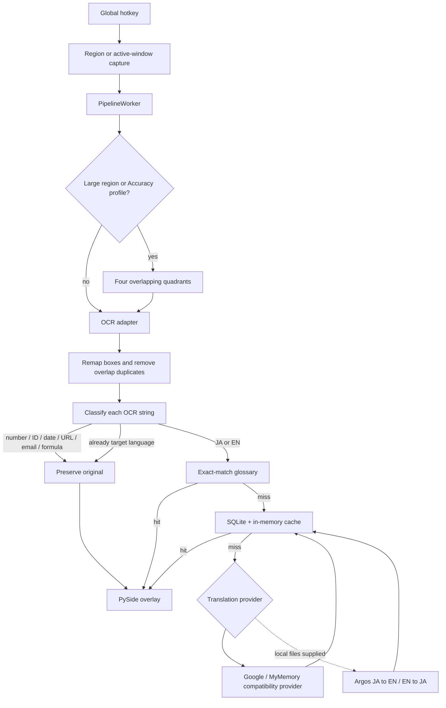

# PyLens architecture

This document describes the code as implemented. Dashed nodes are prepared but
not activated until their manually supplied runtime/model files are present.

## Runtime design



## Design boundaries

- `capture/` owns Windows screen acquisition only.
- `ocr/` owns preprocessing, tiling, model adapters, and capture-local boxes.
- `text/` owns deterministic text decisions. It does not call OCR or translation.
- `translate/` owns provider routing, terminology, and persistence.
- `overlay/` only renders `TextBlock` values. It does not infer or translate.
- `app.py` is the composition root and background-thread coordinator.

The OCR and translation providers use small protocols. This keeps Windows OCR,
PaddleOCR, Google, and Argos replaceable without changing capture or overlay
code.

## File graph

```text
src/pylens/
├── app.py                         composition + worker thread
├── models.py                      CaptureResult and TextBlock
├── paths.py                       project-local model/glossary paths
├── settings.py                    persisted user settings
├── capture/
│   ├── region.py                  marquee capture
│   └── window.py                  active-window capture
├── ocr/
│   ├── base.py                    OcrAdapter contract
│   ├── factory.py                 Paddle / Windows selection
│   ├── paddle_adapter.py          Paddle recognition
│   ├── windows_adapter.py         optional WinOCR
│   ├── preprocess.py              bounded profile scaling
│   └── tiles.py                   2x2 overlap, remap, de-duplicate
├── text/
│   ├── classify.py                skip / JA / EN / mixed
│   ├── normalize.py               NFKC + stable cache keys
│   └── glossary.py                exact terminology lookup
├── translate/
│   ├── base.py                    Translator protocol
│   ├── service.py                 skip → glossary → cache → provider
│   ├── cache.py                   LRU + SQLite
│   ├── google.py                  compatibility online provider
│   └── argos.py                   prepared offline provider
└── overlay/
    ├── layout.py
    └── window.py

data/glossary/ja_en.default.json    bundled business terminology
models/argos/                       manually supplied Argos archives (ignored)
vendor/wheels/                      manually supplied offline Python wheels
tests/                              behavior tests for each new boundary
```

## Current implementation status

Implemented:

- Translation skip rules for numeric and machine-readable content.
- JA, EN, and mixed-script classification.
- Exact-match default/user glossary loading.
- Thread-safe SQLite cache plus a 512-entry memory LRU.
- Translation provider separation and an Argos local-file adapter.
- Balanced/fast/accuracy OCR scale bounds.
- Four overlapping OCR compartments with coordinate remapping and de-duplication.
- Automatic downloads disabled in application and Settings UI.

Awaiting manually supplied files:

- Argos Python wheelhouse and the JA→EN model archive.
- Optional EN→JA model archive.
- Provider activation and real translation benchmark.
- PP-OCRv5 evaluation only after benchmark screenshots are available.
